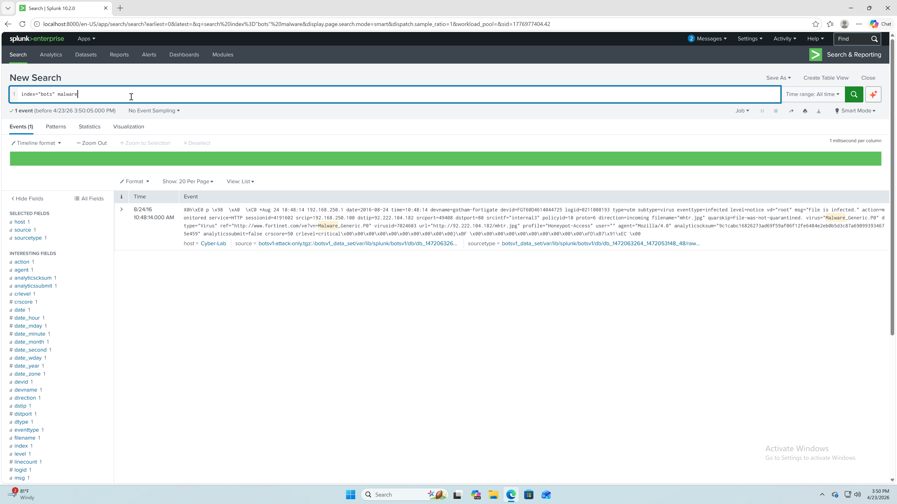
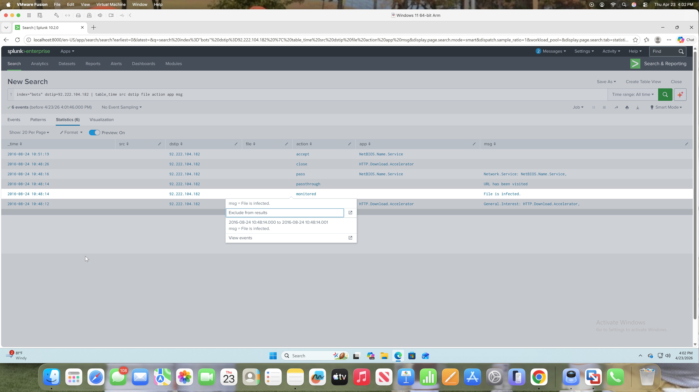
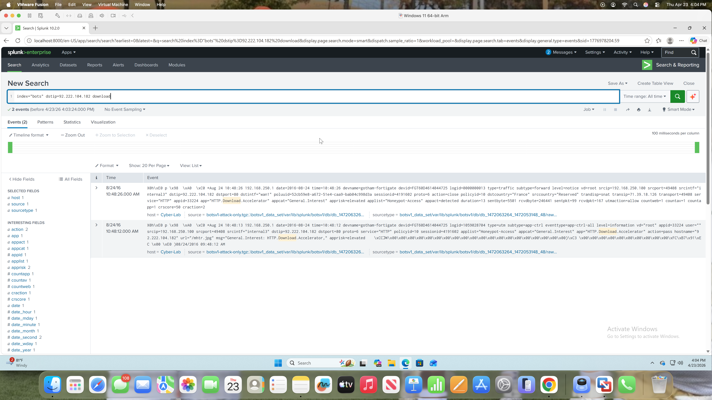

SIEM Threat Hunting Lab

This project demonstrates a SIEM-based threat hunting investigation using Splunk and the BOTS dataset.
The goal was to simulate real SOC analyst behavior by identifying suspicious activity, analyzing network traffic, and investigating potential malware infections.

 Skills Demonstrated
- SIEM log analysis (Splunk)
- Threat detection & investigation
- Network traffic analysis
- Indicator pivoting (IP-based analysis)
- SOC incident response workflow

Investigation Process

1. Identify Suspicious Activity
SPL:
index="bots" malware
- Identified infected host: 192.168.250.100

2. Analyze Outbound Traffic
SPL:
index=bots srcip=192.168.250.100 
| stats count by dstip 
| sort -count
- I establed a baseline of normal outbound traffic, then pivoted to a flagged malicious IP 92.222.104.182 identified in malware logs. 

3. Investigate External Communication
SPL:
index="bots" dstip=92.222.104.182 | table_time src dstip file action app msg

4. Check Download Activity
SPL:
index=bots dstip=92.222.104.182 download
- Observed HTTP download activity
- Logs indicated: "File is infected"

Key Findings:
- Internal host 192.168.250.100 communicated with external IP 92.222.104.182
- Suspicious HTTP download activity detected
- Security logs flagged potential malware infection
- Multiple interactions suggest repeated behavior

 Conclusion:
This investigation simulated a real-world SOC scenario where suspicious traffic was identified, analyzed, and validated as potential malware activity.

The workflow demonstrates how analysts:
1. Detect anomalies
2. Pivot across logs
3. Investigate indicators
4. Determine incident severity

Screenshots:
Baseline Traffic Analysis

This screenshot shows the top external IPs contacted by the infected host, highlighting abnormal outbound patterns.

Malicious IP Investigation

Download Activity Evidence

